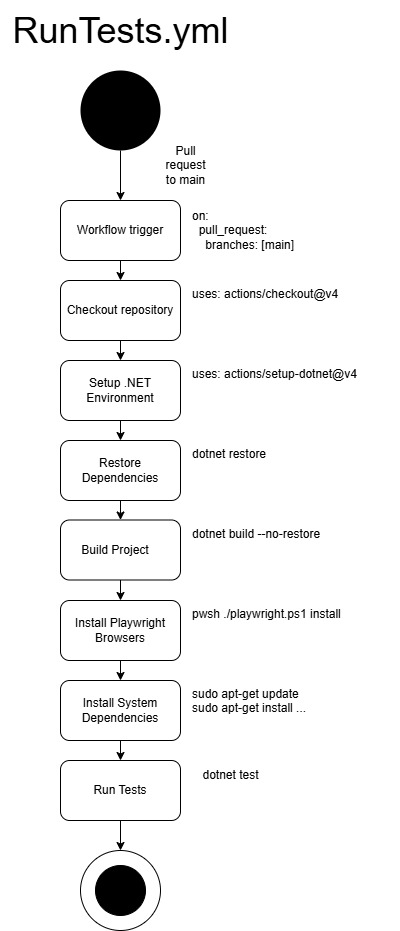
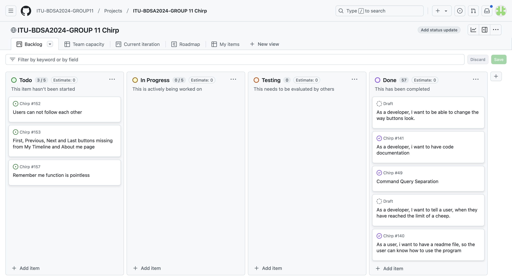

---

title: _Chirp!_ Project Report  
subtitle: ITU BDSA 2024 Group 11  
author:  
- "Bastian Gram Poulsgaard <bapo@itu.dk>"  
- "Lisa Claudi Hauge <lish@itu.dk>"  
- "Jon Lehmann <jble@itu.dk>"  
- "Oliver Brinch <olibr@itu.dk>"  
- "Frederik Buur <fbuu@itu.dk>"  
numbersections: true  

---

# Chirp!

### [**Design and architecture**](#design-and-architecture)

[Domain model](#domain-model)

[Architecture — In the small](#architecture-in-the-small)

[Architecture of deployed application](#architecture-of-deployed-application)

[User activities](#user-activities)

[Sequence of functionality/calls through Chirp!](#sequence-of-functionalitycalls-through-chirp)

### [**Process**](#process)

[Build, test, release, and deployment](#build-test-release-and-deployment)

[Teamwork](#teamwork)

[How to make Chirp! work locally](#how-to-make-chirp-work-locally)

[How to run test suite locally](#how-to-run-test-suite-locally)

### [**Ethics**](#ethics)

[License](#license)

[LLMs, ChatGPT, CoPilot, and others](#llms-chatgpt-copilot-and-others)

# Design and architecture 

## Domain model 
{ height=50% }  

Our program uses ASP.NET Identity to handle user logins. 

## Architecture — In the small

Our application is based on the onion structure. The layers and the corresponding components are illustrated below: 

{ height=50% } 

## Architecture of deployed application

Clients live as browser based applications. The server app is hosted in an Azure web app that also hosts the database which is a SQLite file based database. This is illustrated below: 

{ height=50% } 

## User activities

As a non-authorized user, you are able to see the “Public Timeline” page, which is also the website's landing page. Under the “Chirp\!” logo you have the opportunity to navigate to a “Register” page and a “Log in” page. 

If you scroll to the bottom of the page you will see 4 buttons allowing you to switch between pages, or go directly to the first or last page. The “First” and “Previous” buttons are blocked when you are on the first page, and the same goes for the “Next” and “Last” buttons when you are on the last page. 

{ height=30% }   

When clicking on the register link, you enter a registration page, here you can create a new account. Either with an email address of your own choice, or you can choose to use GitHub when creating an account. You also have a link guiding you to the “Log in” page, if you already have an account. The website will give the user feedback, if the username is taken or the password does not meet the requirements. 
 
{ height=30% } 

After account creation, you are now logged in. A logged in user will see another version of the “Public Timeline” page. There is a box where you can cheep, all cheeps will end up on this page. You also have the opportunity to follow other users. If you cheep you will not see the “Follow” button next to you, but instead an “Edit” button. After clicking the “Edit” button, a new text input field will appear, along with the buttons “Save” and “Delete”. So it is possible for the user to either update the cheep or delete it. After editing a cheep, it will be displayed next to the timestamp, so other users know this cheep has been edited.  
 
{ height=30% }    

A logged in user can also navigate to “My Timeline”. All of the users cheeps, and the cheeps of the users followed will be present here. As displayed, the user can also choose to unfollow. 

If the user cheeps from this page, it will still appear on the “Public Timeline” page. The user can also cheep pictures or GIF’s by copying the corresponding image address and pasting the link as a cheep. 

{ height=30% }    
 

A logged in user will see a link called about me. This page lets you see all your information (username, email, following and cheeps made by the user). On this page, there also is a possibility to delete your account.  
       
{ height=30% }  

It is at all times possible to logout by clicking the logout(username) link. If a user wants to log in again later, it is possible to do so by clicking the login link. Here the user can login with their username and password. If you have not created an account, but used github, you will need to use the “GitHub” button on this page as well.  

{ height=30% }     

## Sequence of functionality/calls through Chirp\!
{ height=50% }
{ height=50% }
{ height=50% }
{ height=50% }
{ height=50% } 

# Process

## Build, test, release, and deployment
           
On pull request to main the following process will take place: 

{ height=50% } 

This workflow takes all the necessary steps to build and test the project.
The workflow runs on pull requests to main (it also runs on pushes to main) so that potentaial errors will be noticed before merging into the main branch.

On push to main the following process will take place: 

{ height=50% } 

These workflows runs once a pull request has been approved and merged into the main branch.  
The RunTests.yml workflow has already ran once when the pull request was first created and is in theory unnecessary, however it still runs an extra time for absolute safety. 
The main_bdsagroup11chirprazor.yml workflow updates azure and pushes the changes. 

## Teamwork
                  
{ height=50% } 

The three tasks in the Todo part of our Project board are bugs recently noticed. These bugs will be resolved as soon as possible, but we prioritized the report since the deadline came before.
             
This board has worked well as an overview of our requirements and own features, since it has been broken down into smaller tasks that are easier to understand and therefore easier to start working on. The project board also made it easier to create issues when bugs were found, to make sure we would remember and solve them.

The illustration below shows our usual flow from the creation of an issue until a feature is merged into our main branch. 

{ height=70% }      

## How to make Chirp! work locally

To run the program locally you need to have .net8 installed

To clone the repository to your computer you need to have git installed.  
Once git is installed, run the following command:  
`git clone [https://github.com/ITU-BDSA2024-GROUP11/Chirp.git](https://github.com/ITU-BDSA2024-GROUP11/Chirp.git)` 

After having cloned the repository locally to your machine you need to do the following steps, which are also in the readme.md file. 
From the root directory of the project in your termial run the following commands:  

`cd src/Chirp.Web/`  

`dotnet user-secrets init`  

`dotnet user-secrets set  "authentication\_github\_clientId" "Ov23liN6Yjxe3rEIVpMB"`  

`dotnet user-secrets set  "authentication\_github\_clientSecret" "983419733e343552b15de88bbf4b5d170fa30420"`

When this is done you should be able to run the program from the same location using `dotnet run`.

This should open your default browser and you will be able to use the program as desired.

## How to run test suite locally

This section assumes that you have successfully run the program, if you have not yet done that please refer to the section “How to make Chirp! work locally”.

To run tests locally you need to have powershell installed if you are not already using powershell as your preferred shell.  

On Linux: `sudo apt update && sudo apt install \-y powershell`  

On MacOS: `brew install \--cask powershell`  

On Windows: Skip this step

From the root directory of the project, run the following command to install playwright:

`pwsh ./test/PlaywrightTests/bin/Debug/net8.0/playwright.ps1 install`

Now to run the tests simpy run the command `dotnet test`.

# Ethics

## License

When selecting a license, the key factor is whether any GPL libraries are used in the project, as their presence mandates the use of a GPL license. In this case, none of the libraries included have a GPL or other copyleft license. Consequently, the decision on licensing was flexible, and the MIT license was chosen. The MIT license is among the most permissive options, enabling the software to be used for virtually any purpose, provided the original copyright notice and license are retained. It also absolves the developers of any obligation to maintain the software. As highlighted in the open source lecture, adopting an open-source license offers numerous benefits. Furthermore, given the project's educational nature, it is both practical to maximize openness and to disclaim responsibility for long-term code maintenance.

## LLMs, ChatGPT, CoPilot, and others

ChatGPT as well as CoPilot was used by some of the group members in assistance of developing the project. ChatGPT was used in different scenarios but never as the first measure.   
When it came to resolving problems with different package installations and similar issues it was very effective. However when trying to use it for directly code related issues the helpfulness varied a lot, some code related issues it would give a great solution to, whilst others it would provide a solution which we might not have fully understood which ended up giving us problems either when directly trying to implement it or, if changes later were necessary.

Taking everything into account the use of ChatGPT and CoPilot has probably sped up the process a bit.

